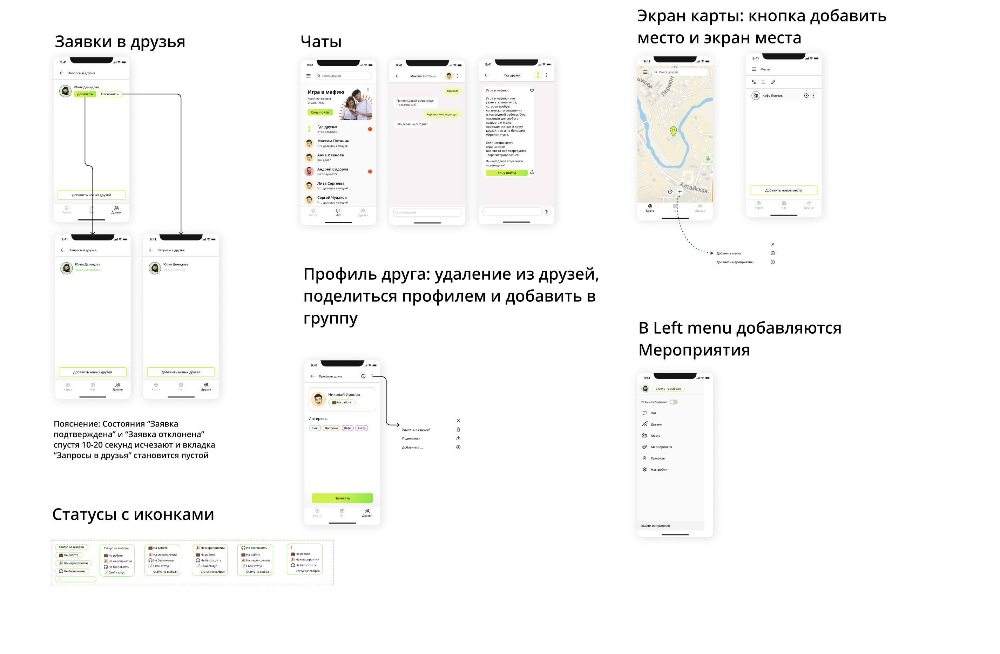

# Where are my friends?


### Link for the website:

https://flap.acceleratorpracticum.ru/


### Project description:

Web application for finding friends on the map. Here people can search and add new friends, share their geolocation and see the location of a friend, gather for fun meetings and have a great time.

Project appearance:



Used technologies:
-
    - python 3.11
    - django 4.1
    - djangorestframework 3.14
    - python-dotenv 0.21.1
    - django-filter 22.1
    - PostgreSQL 13.0
    - Docker


Features:
-
    - You can search and add new friends
    - You can view your friends location
    - You can invite new friends
    - You can accept friend requests
    - You can remove users from friends
    - Admin-zone


# Launch instructions:

Copy the docker-compose.yml and nginx.conf files from the infra folder to the remote server:

```
cd backend/infra/
```

```
scp docker-compose.yml <username>@<IP>:/<address of your project on the server>/
scp nginx.conf <username>@<IP>:/<address of your project on the server>/
# username - username of the server
# IP - public IP address of the server
```

## enviroment:
In the repository settings on GitHub, create environment variables in the Settings -> Secrets -> Actions:
- SECRET_KEY=... # secret key from Django project
- DB_ENGINE=... # indicate that we are working with postgresql
- DB_NAME=... # database name
- POSTGRES_USER=... # login to connect to the database
- POSTGRES_PASSWORD=... # password to connect to the database (set your own)
- DB_HOST=db # name of the service (container)
- DB_PORT=5432 # port to connect to the database
- EMAIL_HOST_USER=friends-locator@yandex.ru
- ELASTICEMAIL_API_KEY=... # email integration key
- LOCALHOST=localhost
- LOCALHOST_IP=127.0.0.1
- CONTAINER_NAME=... # name of your container
- DOMAIN=flap.acceleratorpracticum.ru
- SERVER_IP=... # IP of your server
- EVERYONE=0.0.0.0


## Docker:
1. This app's using external volume for DB so before you start you should create this volume:
    #### docker volume create --name=pg_volume
2. After that build and launch containers:
    #### docker-compose up -d --build
For now app is available at localhost


If you'll need any *manage.py* commands then you'll want to use prefix:

    docker-compose exec backend python manage.py *comand*

Admin-zone is available at:

    https://your_host/admin/

All available endpoints and responses you can find in documentation:

    https://your_host/api/docs/


Examples requests:
-
    - GET http://127.0.0.1:8000/api/v1/users/me
    - POST http://127.0.0.1:8000/api/v1/users/id/add-friend
    - DELETE http://127.0.0.1:8000/api/v1/users/id/delete-friend

Examples of responses:
-
    - GET {
        "id": 5,
        "email": "kolya@mail.ru",
        "username": "kolya",
        "first_name": "",
        "last_name": ""
        }
    - POST {
        "id": 3,
        "email": "pasha@mail.ru",
        "username": "pasha",
        "first_name": "",
        "last_name": ""
        }

### Project authors:

Larkin Mikhail
https://github.com/IhateChoosingNickNames

Klyahina Maria
https://github.com/ifyoumasha

Sheremet Oksana
https://github.com/sheremet-o

Zolkov Denis
https://github.com/ggastly

Antonevich Fedor
https://github.com/LevityLoveLight

Smirnov Alexey
https://github.com/AxelVonReems
